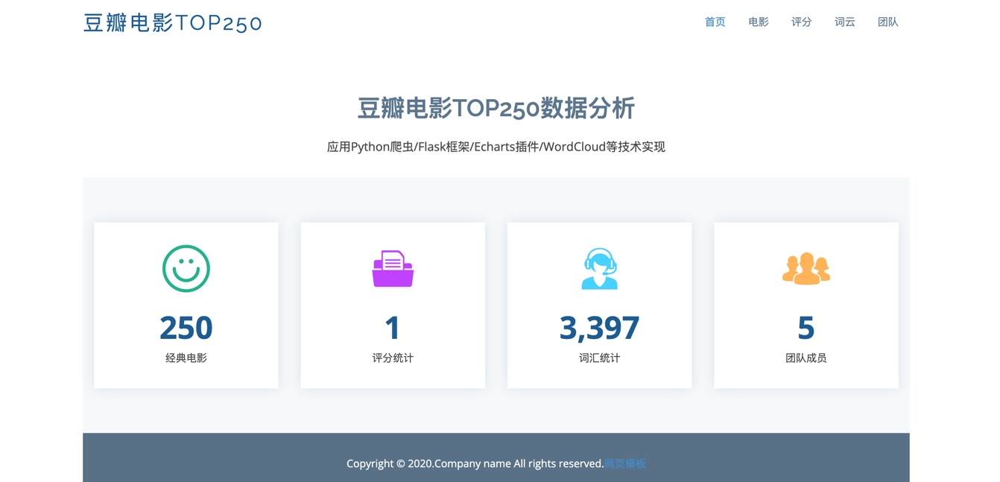
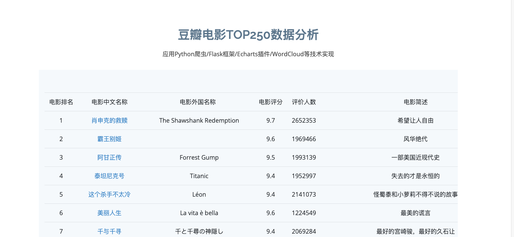
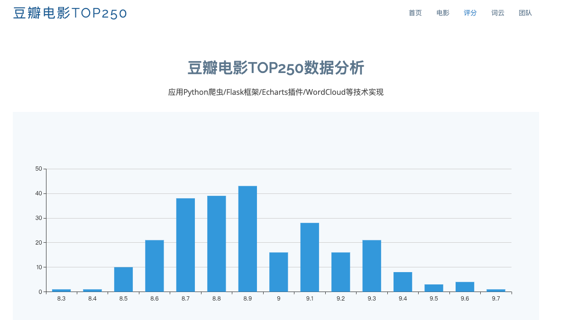
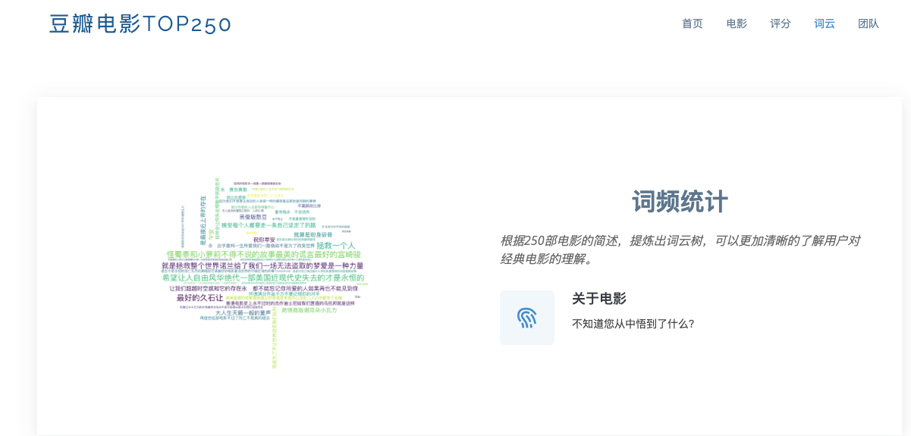

# Douban_Flask

#### 介绍
* 豆瓣电影TOP250数据分析   
* 应用Python爬虫/Flask框架/Echarts插件/WordCloud等技术实现

#### 软件架构
软件架构说明

#### 安装教程

1.  安装所需的第三方库：pip install -r requirements.txt
2.  运行：python app.py

#### 项目简介

1.  Python3.8 + Flask 3.0.2
2.  使用爬取豆瓣电影TOP250的数据，并使用Flask框架搭建一个简单的Web应用，实现对电影信息的展示、搜索、排序和分页功能。
3.  使用Echarts插件实现电影评分、电影类型、电影地区、电影年份的分布图展示。
4.  使用WordCloud插件实现电影简介的词云展示。

* 知识点：生成项目虚拟环境下所需的第三方模块( pip freeze > requirements.txt 命令，会将不是虚拟环境下的第三方模块加到requirements.txt文件中) 
  * 使用 pipreqs：
    * pip install pipreqs
    * pipreqs  ./

5. 

6. 
7. 
#### 参与贡献

1.  Fork 本仓库
2.  新建 Feat_xxx 分支
3.  提交代码
4.  新建 Pull Request

#### 特技

1.  使用 Readme\_XXX.md 来支持不同的语言，例如 Readme\_en.md, Readme\_zh.md
2.  Gitee 官方博客 [blog.gitee.com](https://blog.gitee.com)
3.  你可以 [https://gitee.com/explore](https://gitee.com/explore) 这个地址来了解 Gitee 上的优秀开源项目
4.  [GVP](https://gitee.com/gvp) 全称是 Gitee 最有价值开源项目，是综合评定出的优秀开源项目
5.  Gitee 官方提供的使用手册 [https://gitee.com/help](https://gitee.com/help)
6.  Gitee 封面人物是一档用来展示 Gitee 会员风采的栏目 [https://gitee.com/gitee-stars/](https://gitee.com/gitee-stars/)
